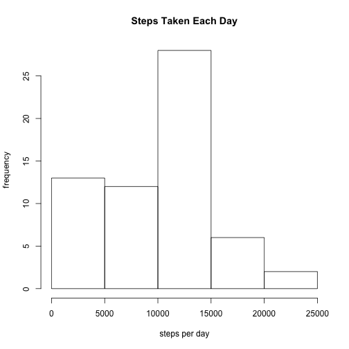
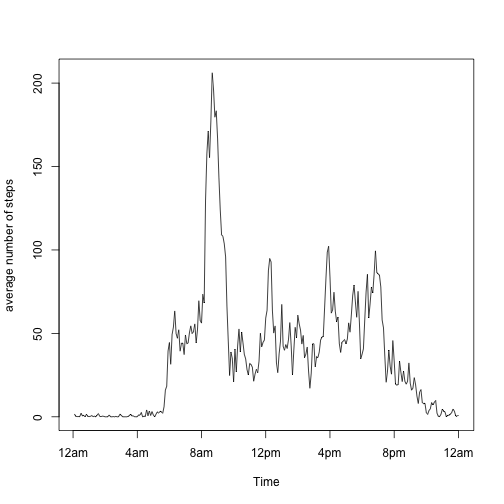
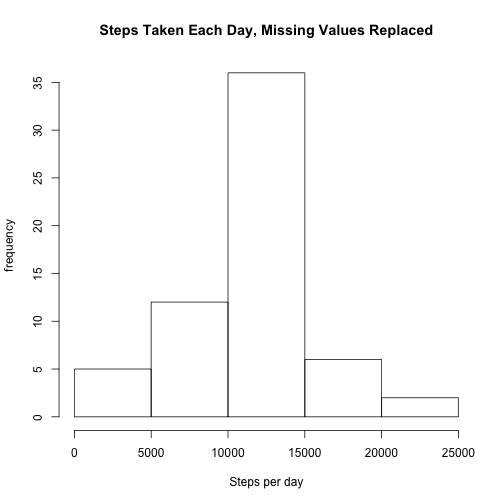
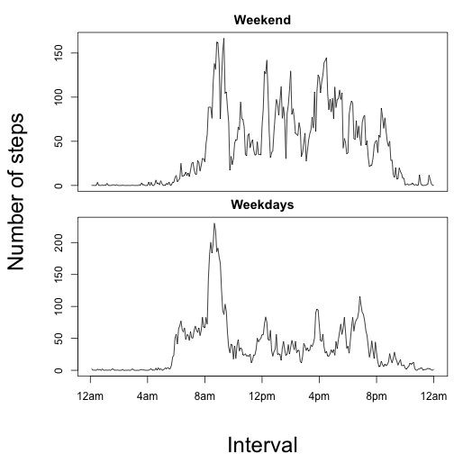

## Loading and preprocessing the data

#### This project uses a set of data containing 2 fields, which are 5-minute intervals throughout the day and steps taken. Data is collected for one individual over the course of 2 months.

*This code loads the data and the necessary libraries.*

```r
steps_df <- read.csv('activity.csv', header = TRUE)
library(dplyr)
library(ggplot2)
```

## What is mean total number of steps taken per day?


*This code sums the steps in each day of the study. It creates a histogram from those sums.*

```r
by_day <- group_by(steps_df,date)
daily_sums <- summarize(by_day, sum(steps,na.rm = TRUE))
hist(daily_sums$`sum(steps, na.rm = TRUE)`, ylab = "frequency",xlab = "steps per day", 
     main = "Steps Taken Each Day")
```

 

*This code finds the mean and median of the daily steps.*

```r
ave_steps <- round(mean(daily_sums$`sum(steps, na.rm = TRUE)`))
med_steps <- median(daily_sums$`sum(steps, na.rm = TRUE)`)
```
#### The mean number of steps is 9354. The median number of steps per day is 10395.
----

## What is the average daily activity pattern?

*This code groups the data by the 5 minute intervals in a day. Then it finds the average number of steps in each of those intervals across all the days of the study.*

```r
by_interval<- group_by(steps_df,interval)
interval_ave <- summarize(by_interval, mean(steps, na.rm = TRUE))
```

*For convenience, I change the name of the average interval column. Then I find the interval corresponding to it's max. The number of the interval is more interesting as a time, so I did that conversion.*

```r
names(interval_ave)[2] <- "int_ave"
max_int <- which.max(interval_ave$int_ave)
max_time <- paste(floor(max_int/12),":",max_int%%12*5, sep = '')
```
*This code plots the time series graph of average steps by 5 minute interval.*

```r
plot.ts(interval_ave$int_ave, ylab = "average number of steps", xaxp = c(0,288,12), xaxt = "n")
axis(1,at = c(0,48,96,144,192,240,288),labels = c("12am", "4am", "8am","12pm","4pm","8pm","12am"))
```

 


#### The interval with the highest number of steps is 104   which translates to 8:40. The average daily activity pattern is shown in this graph. There is a high amount of activity in the morning followed by smaller peaks in activity around noon, 4pm and 8pm. There is little or no activity between 10pm and 6am.

## Imputing missing values

*This code is used to replace NAs in the data with estimated values. The values I chose are the average across all days of the 5 minute interval where the NA occurs. This code determines the number of NAs for the report. Then I create a vector, all_impute_values, which is the same length as the steps field, and is made up of the averages of all 5 minute intervals. It is repeated 61 times for the 61 days. Then I create a logical vector, na_positions, to find the positions of the NAs in the steps column. Then I locate the values in those same positions in all_impute values. Finally, I replace the NAs with those values.*


```r
total_NAs <- sum(is.na(steps_df$steps))
all_impute_values <- rep(interval_ave$int_ave, times = 61)
na_positions <- which(is.na(steps_df$steps))
impute_values_needed <- all_impute_values[na_positions]
steps_df$steps[na_positions] <- impute_values_needed
```

#### The number of NAs in the data is 2304.

*This repeats the code for creating a histogram of the steps per day, now using the imputed values. Again the mean and median are computed.*

```r
by_day <- group_by(steps_df,date)
daily_sums <- summarize(by_day, sum(steps,na.rm = TRUE))
hist(daily_sums$`sum(steps, na.rm = TRUE)`, ylab = "frequency", xlab = "Steps per day", main = "Steps Taken Each Day, Missing Values Replaced")
```

 

```r
ave_steps <- round(mean(daily_sums$`sum(steps, na.rm = TRUE)`))
med_steps <- round(median(daily_sums$`sum(steps, na.rm = TRUE)`))
```
#### The mean number of steps is 1.0766 &times; 10<sup>4</sup>. The median number of steps per day is 1.0766 &times; 10<sup>4</sup>.
## Are there differences in activity patterns between weekdays and weekends?

*This code processes the dates column, renaming dates by the names of the days of the week. Then I rename those again as either "weekday" or "weekend". Finally, it creates 2 seperate data frames, one with weekday data and the other with weekend data.*

```r
steps_df$date <- as.Date(steps_df$date)
steps_df$day <- weekdays(steps_df$date)
steps_df$day <- ifelse(steps_df$day == "Saturday" | steps_df$day =="Sunday","weekend","weekday")
steps_df$day <- as.factor(steps_df$day)
weekends_df <- subset(steps_df, day == "weekend")
weekdays_df <- subset(steps_df, day == "weekday")
```

*This code averages across 5 minute intervals and creates time series graph as done previously, this time seperating weekday and weekends.*

```r
par(mfrow = c(2,1), mar = c(0,0,2,0), oma = c(6,6,.5,.5))

by_interval_we <- group_by(weekends_df, interval)
interval_ave_we <- summarize(by_interval_we, mean(steps))
plot.ts(interval_ave_we$`mean(steps)`, xaxp = c(0,288,12), xaxt = 'n')
title(main = "Weekend", outer = FALSE)
by_interval_wd <- group_by(weekdays_df, interval)
interval_ave_wd <- summarize(by_interval_wd,mean(steps))
plot.ts(interval_ave_wd$`mean(steps)`,xaxp = c(0,288,12), xaxt = 'n')
title(main = "Weekdays", outer = FALSE)
axis(1,at = c(0,48,96,144,192,240,288),labels = c("12am", "4am", "8am","12pm","4pm","8pm","12am"))
mtext("Number of steps", side = 2, outer = TRUE, line = 4, cex = 2)
mtext("Interval", side = 1, outer = TRUE, line = 5, cex = 2)
```

 

#### The activity pattern is shown in these graphs.
